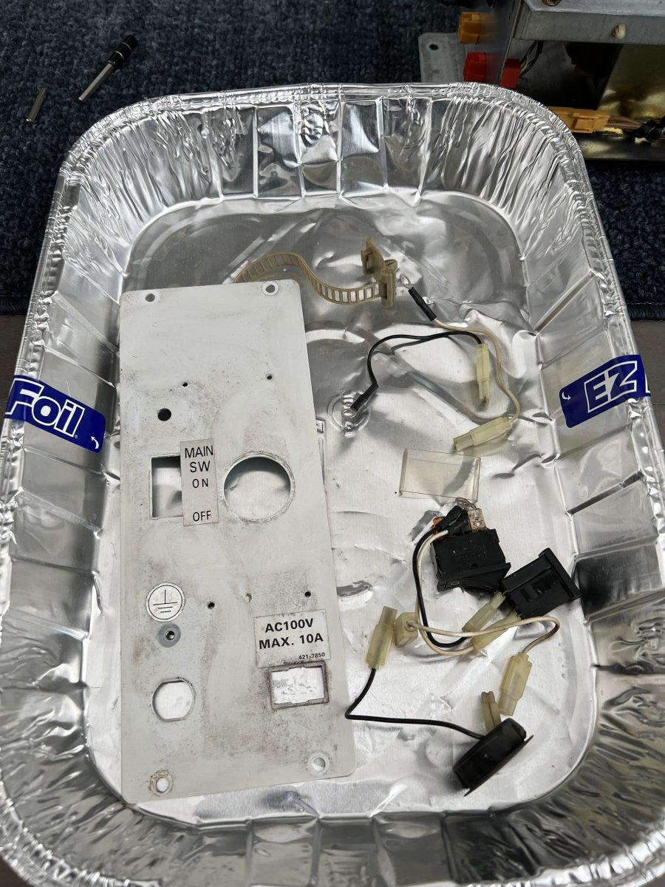
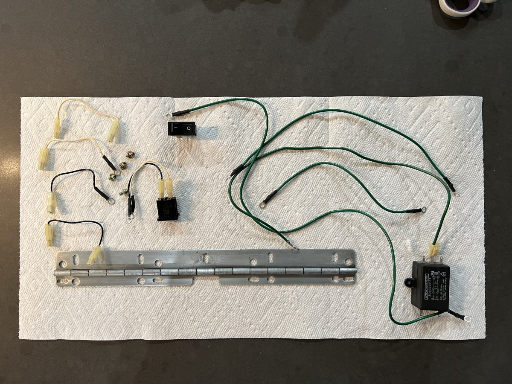
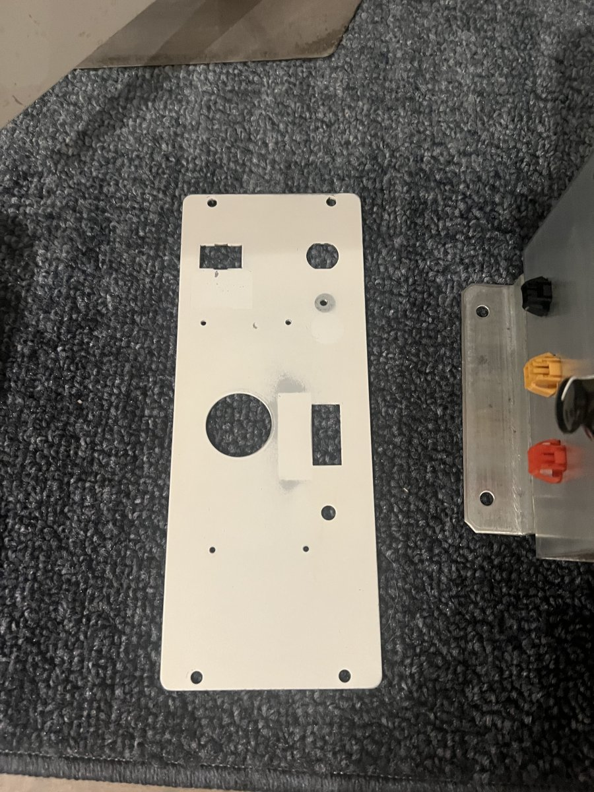
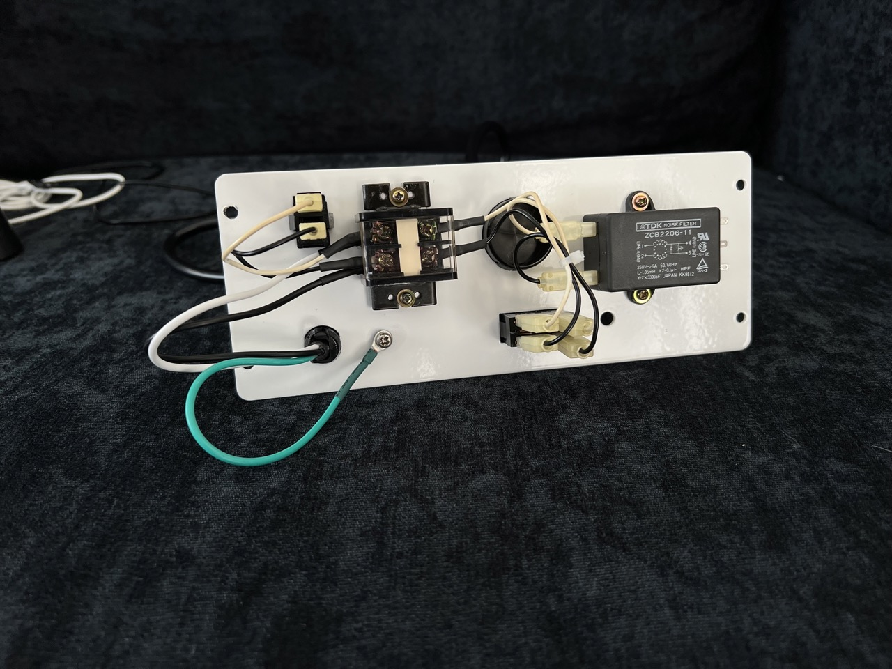

# AC Panel

The AC Panel is quite simple. It's made up of a noise filter, a rocker switch, and an AC receptacle to daisy-chain cabinets. 

The panel is attached with T20 screws. After removal, I bathed the parts in 91% IPA and scrubbed the wires. I then sanded the whole panel as I initially planned to keep the original paint. (I later decided to powder coat).

---

The most important part of this panel is grounding the mains power as these cabinets shipped without a mains ground. As you can see in the photos there is a grounding post in the AC Panel. 

I ordered a new strain relief (which can be found in the cost breakdown) and a new 3-prong cord. After crimping these new wires I was able to add them back into the circuit along with the new ground wire. Since the panel had been powder coated I had to sand around the grounding panel to make sure the connection was strong.
