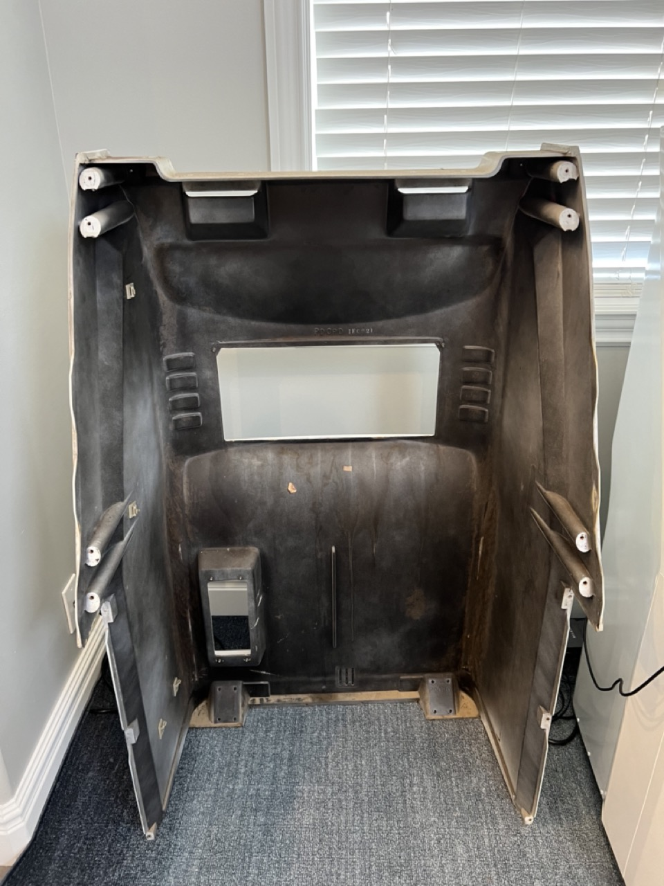
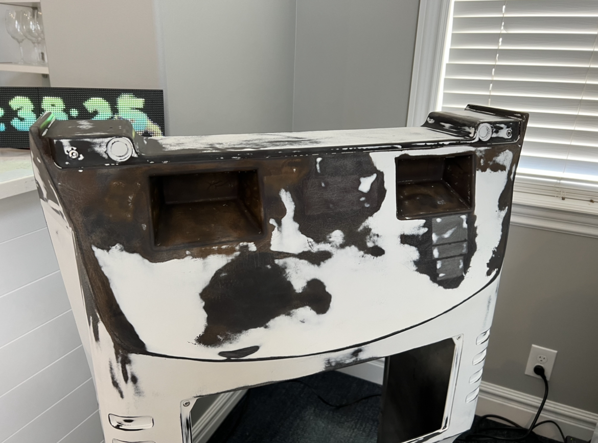
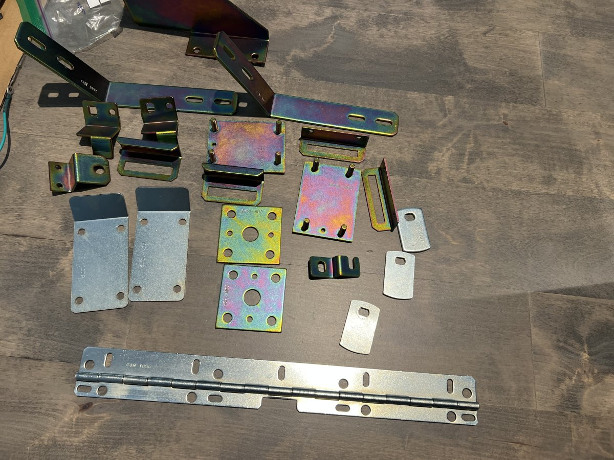
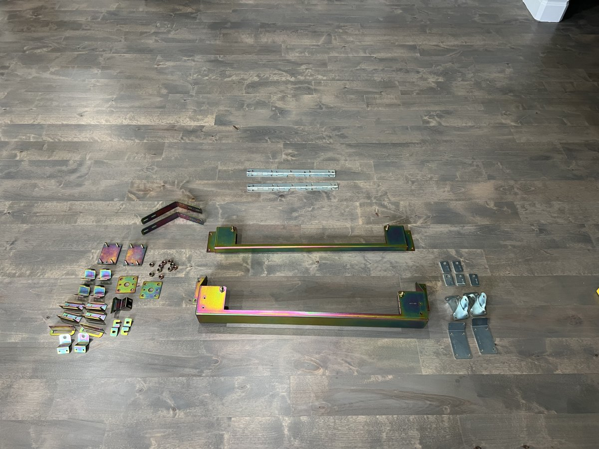

# Body

The main components of these machines are huge fiberglass molds. It's great because they're pretty sturdy, easy enough to repair, and have some flexibility. The downside, though, is that they soak in nicotine and tar like crazy from years of being in smoke-filled arcades. On top of that, sanding them is dangerous without proper PPE. I made sure to get some good goggles and a respirator before attempting any cleaning or sanding of the body. 

Fortunately I have a perfect space in my basement for this work. As you can see, a lot of paint was already starting to flake off. A lot of this was easily blown off with an air compressor. The rest needed to be sanded or sand-blasted. 

The rest of this main piece is quite simple: stickers, wheels, some metal brackets, and a flourescent light.

Any metal pieces that were zinc-plated I had re-plated. This was necessary since, Japan being a much more humid environment, the parts were starting to rust and the original plating was coming off. 

The rest of the metal was stainless steel or similar. I gave that a run through the ultrasonic cleaner and then 91 IPA to displace any water. (Some of the pieces here did end up getting zinc plated).

Finally, some cheap urethane skateboard wheels were a great modification. Much softer on our wood floors and they glow under UV. Cool!

