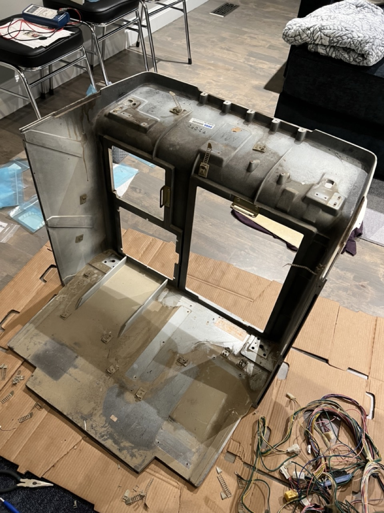
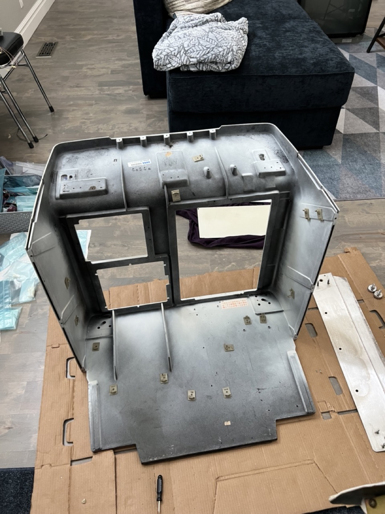
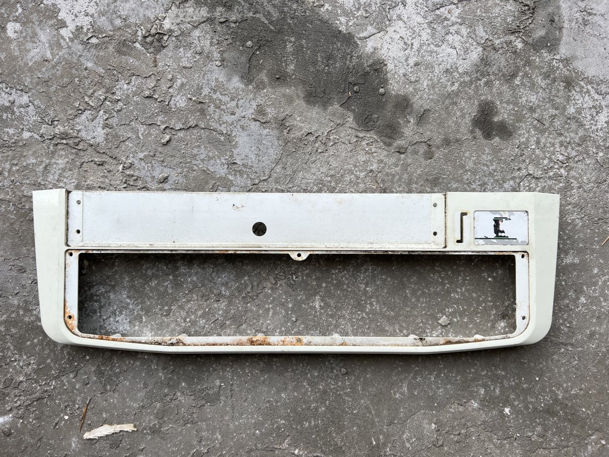
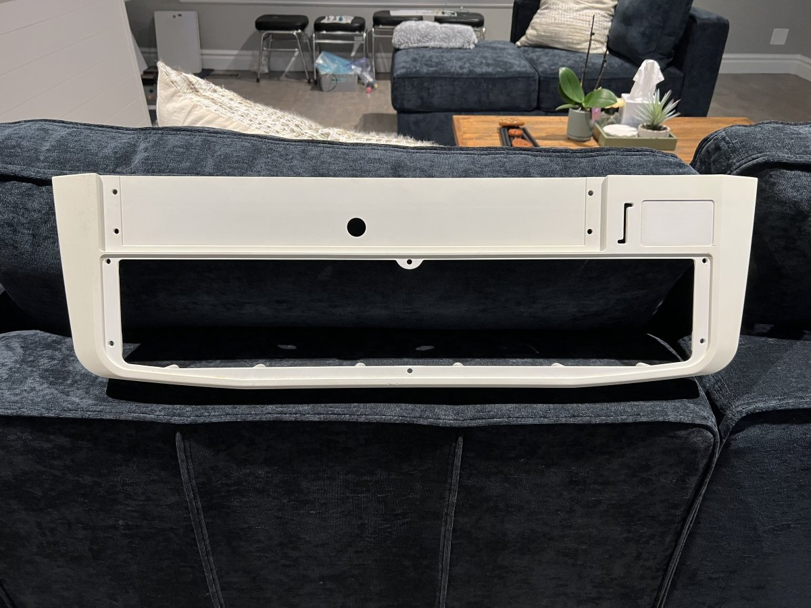
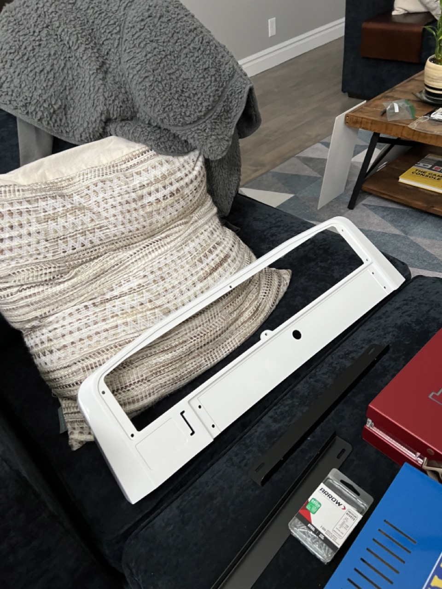
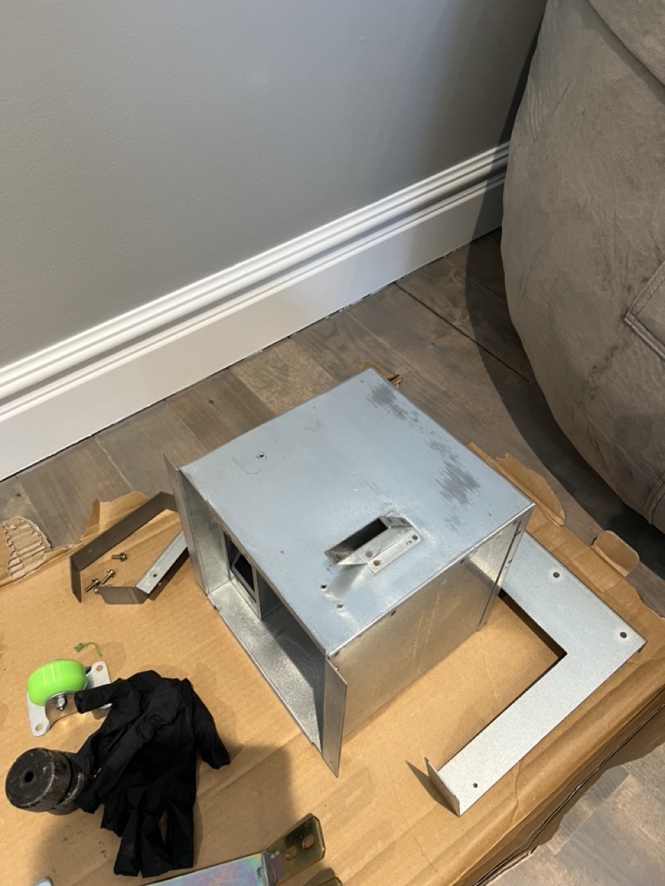
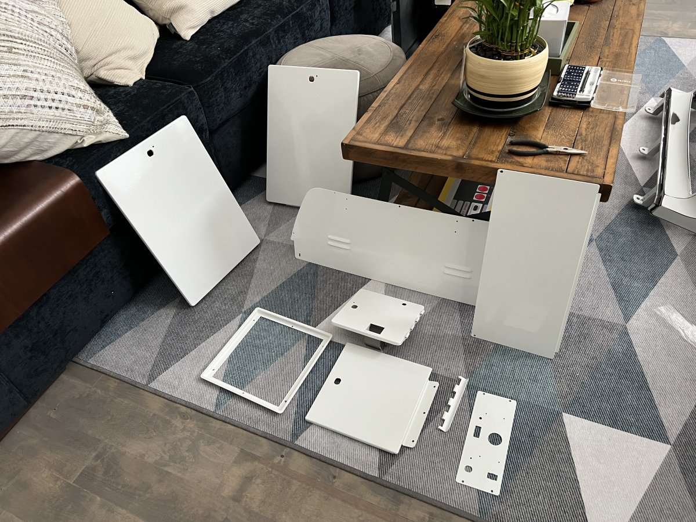
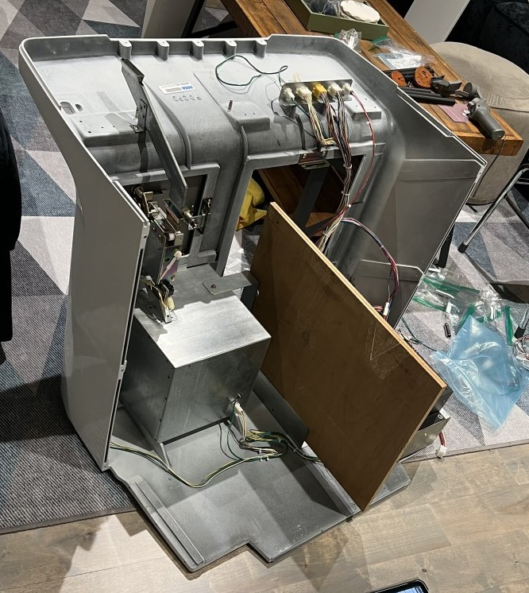
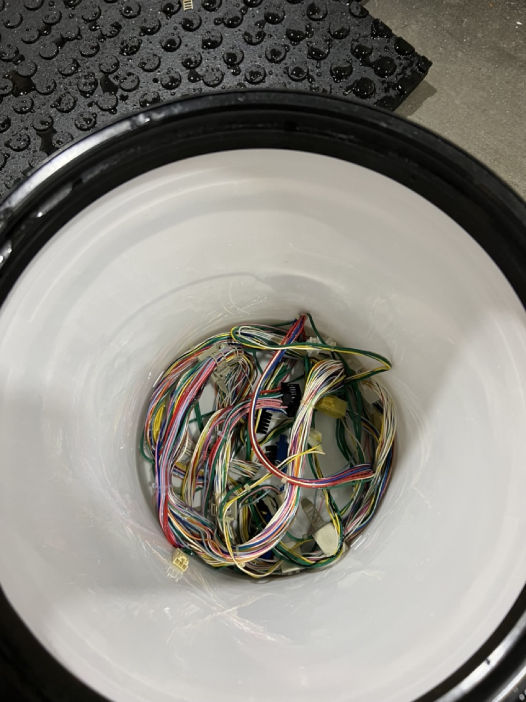
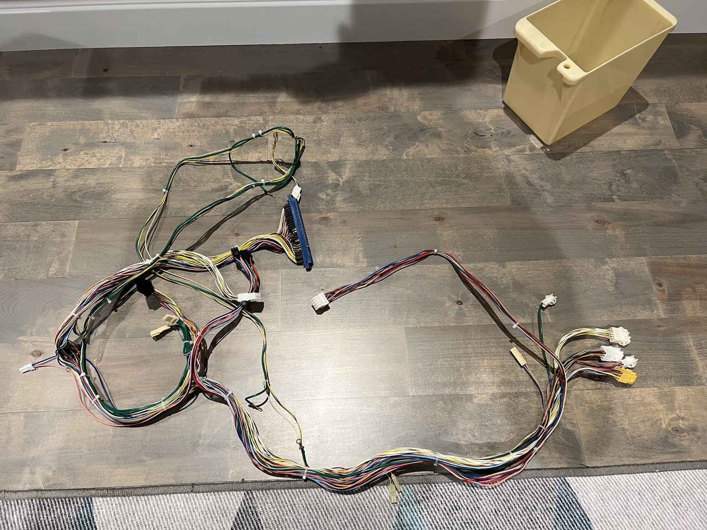

# Cash Box

 Controls 

The control panel. This piece is purely plastic and can usually be easily repaired with a bit of bondo. I sanded this piece down to get rid of any rust and then repaired some small cracks / nicks with bondo.

After sanding and bondo-ing, I eventually had the panel repainted.

Reassembly of the control panel included proper grounding to all metal pieces, a new coin-entry, all new buttons / sticks, and stickers.

 Coin Box 

The coin box is held in with screws, but the coin counter is held in with rivets. They can be easily drilled out and replaced with new aluminum rivets if you have a rivet gun (about $30).

 Front Panel 

<a href="https://www.youtube.com/watch?v=KsF4YLi-4RM">This video</a> shows some of the sandblasting I did to strip down a lot of the paint. All of the metal doors were powder-coated.

The front panel cable management was completely re-done and all metal pieces (if not painted) were re-zinc plated.

 

 JAMMA Harness

The JAMMA Harness was in need of serious cleaning. I ended up replacing all AMP-UP connectors with new ones which meant de-pinning each pin and re-setting them. An example of this process can be found <a href=" https://youtu.be/MTrUsybHri8">here</a>

I also completely cleaned the harness in a bucket of 91% IPA and scrubbed.

