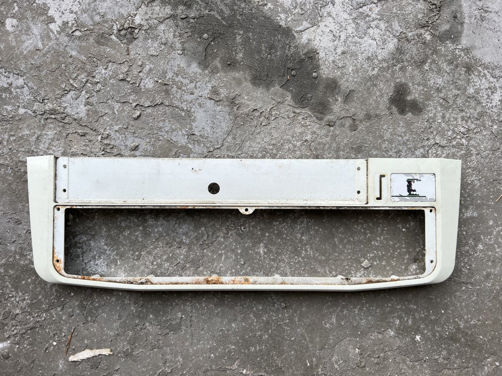
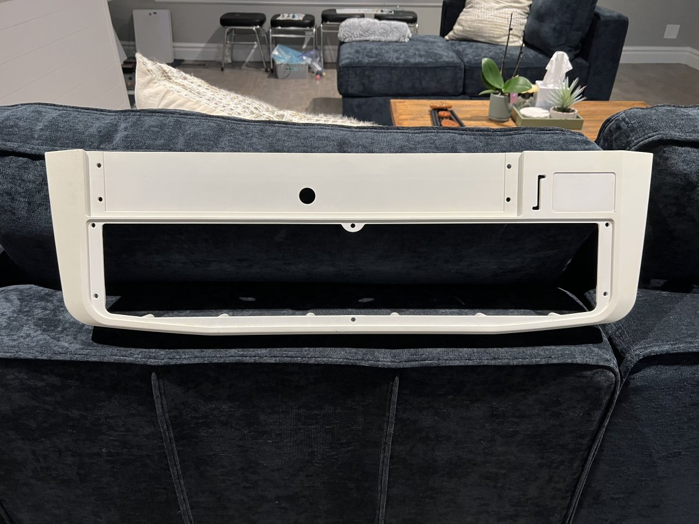
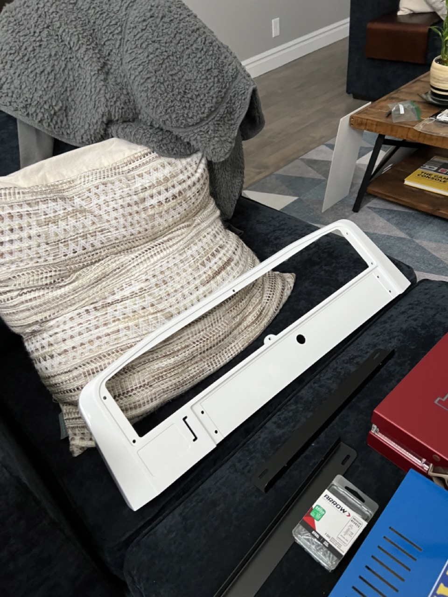

# Control Panel

The control panel. This piece is purely plastic and can usually be easily repaired with a bit of bondo. I sanded this piece down to get rid of any rust and then repaired some small cracks / nicks with bondo.

After sanding and bondo-ing, I eventually had the panel repainted. 

Reassembly of the control panel included proper grounding to all metal pieces, a new coin-entry, all new buttons / sticks, and stickers.