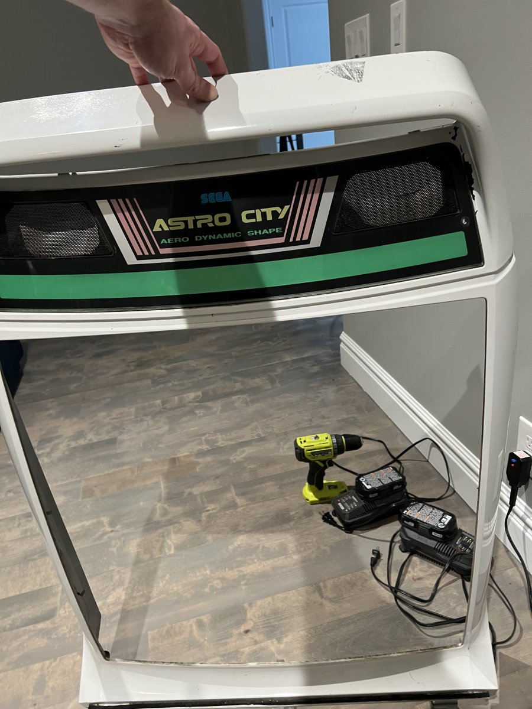
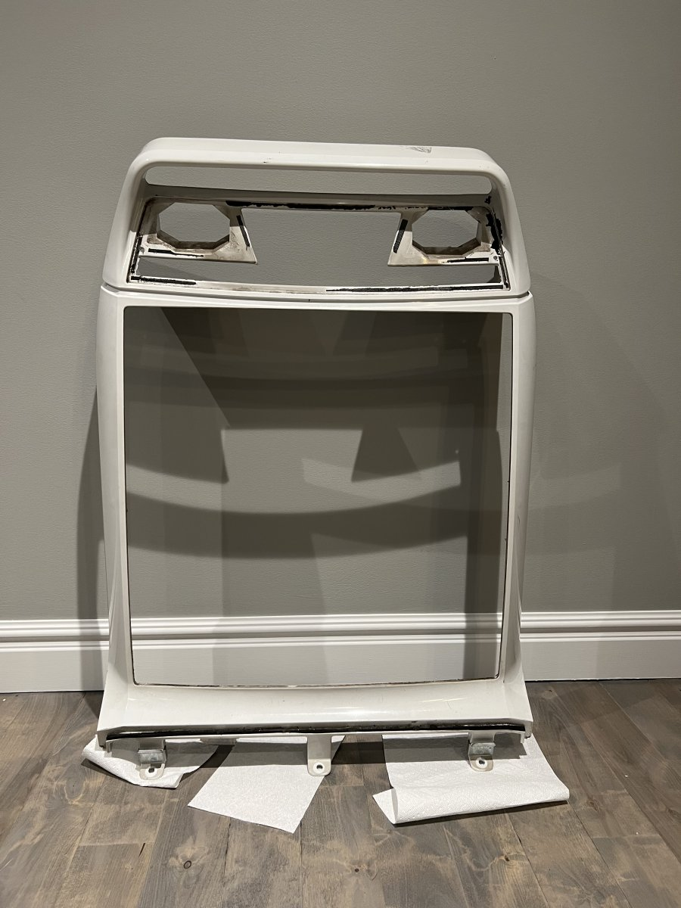
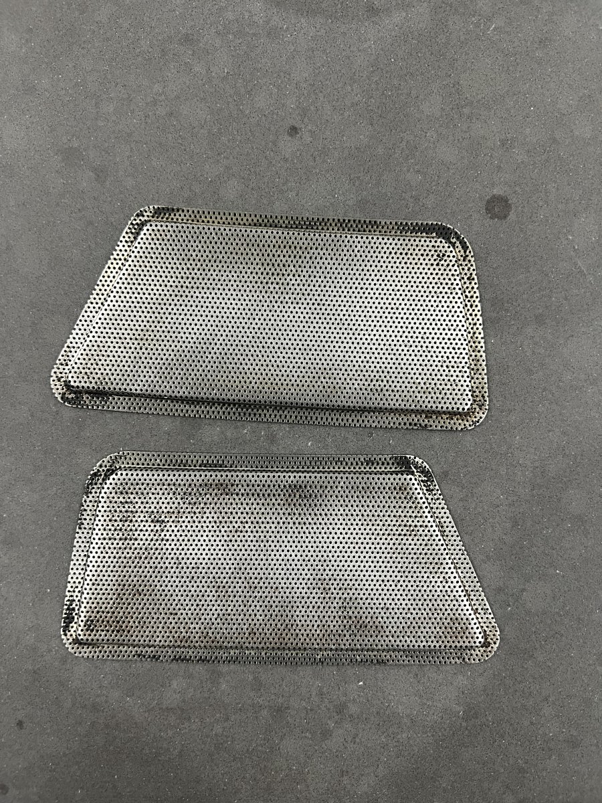
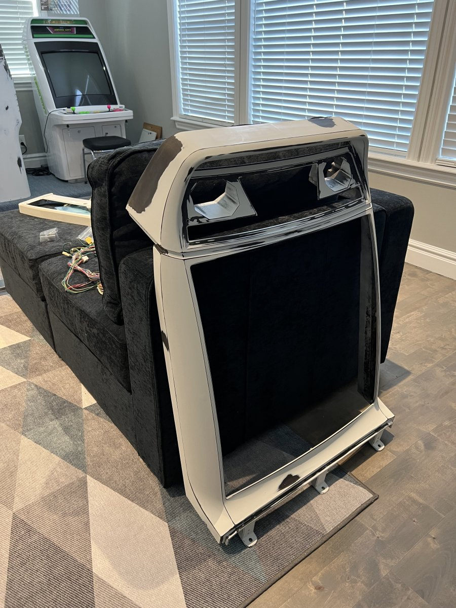

# Front Panel

The front panel holds the speakers, signage, and crt frame. The CRT frame can be turned 90 degrees in order to play vertically scrolling games or horizontal games. 

---

The signage was quite faded. I ended up purchasing a reproduction piece from [ArcadeArtRepro](arcadeartrepro.com). This piece is held in with some thin strips of 3M VHB (Very High Bond). Interestingly, this seems to be the exact same stuff Apple uses to adhere their displays to the body of the iMac. It's a heck of a thing to remove; but goo gone and sanding helped.

Once the signage was removed I was able to clean and prepare the rest of the panel.

I removed the speaker grilles and sanded them clean, then repainted them with a satin rustoleum paint.

After some sandblasting and a little bondo, the front panel was ready for paint.

