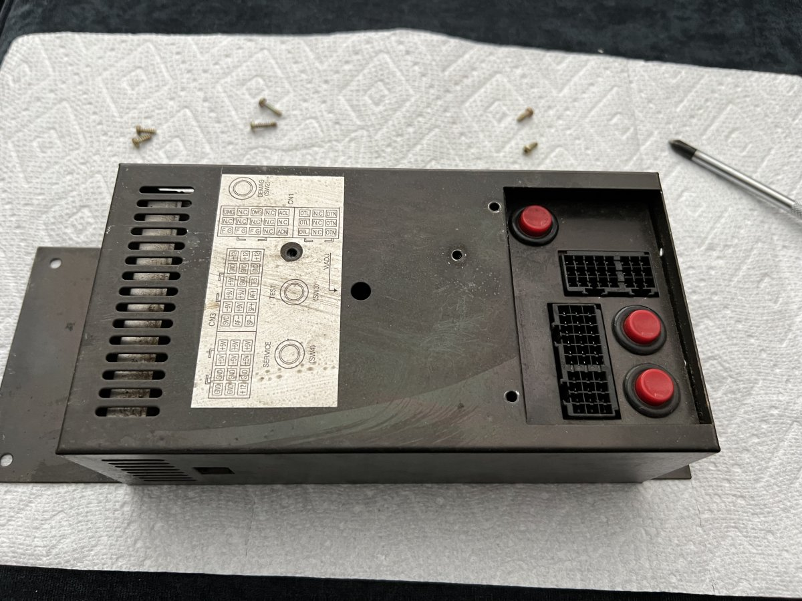
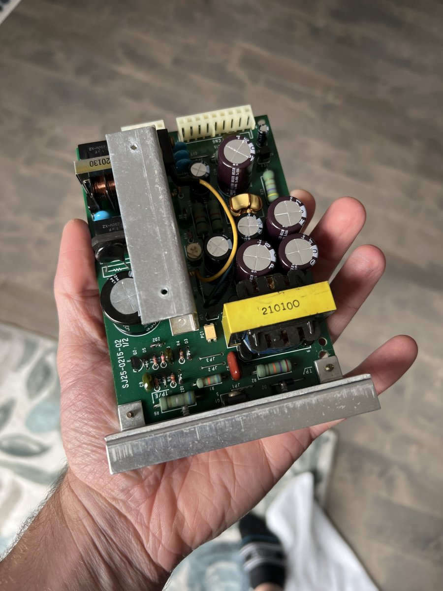
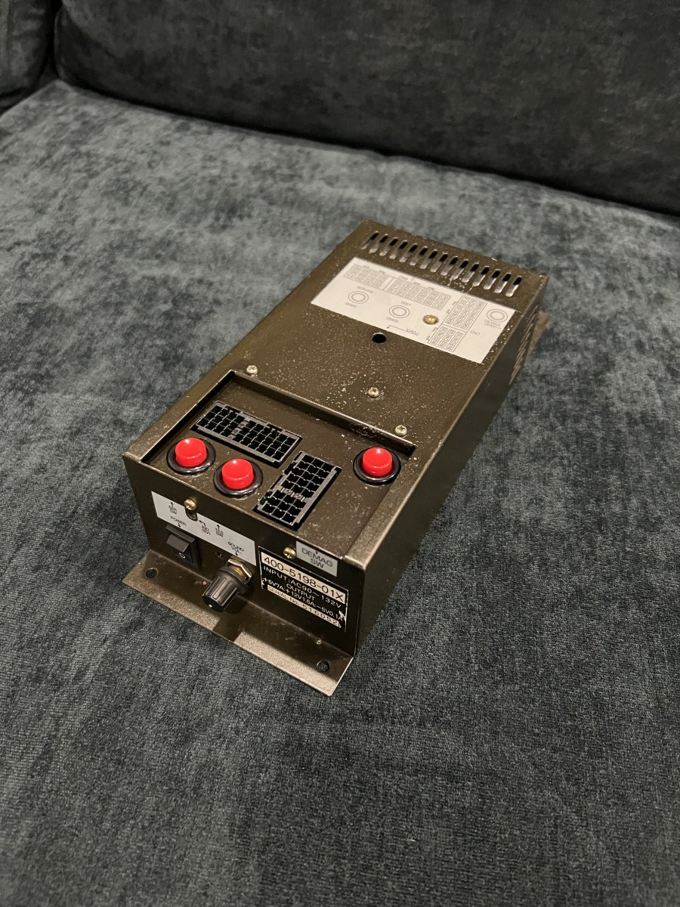

# Power Supply

This power supply was probably the least-exciting re-cap process I've had so far. No broken traces and no oddities with -5v. A simple clean and re-cap was all it needed.

---

Before leaning and re-capping.

This PSU is two boards. Here's one of them after a re-cap. 

The final product. Turned out nice! One word of warning when doing these is that the rheostat for the volume is very fraglie. Removing the dial may bend the spring that's used to contact the coil on the rheostat and cause a poor connection. It's probably best to leave the knob and rheostat in-place if you can stand it!

