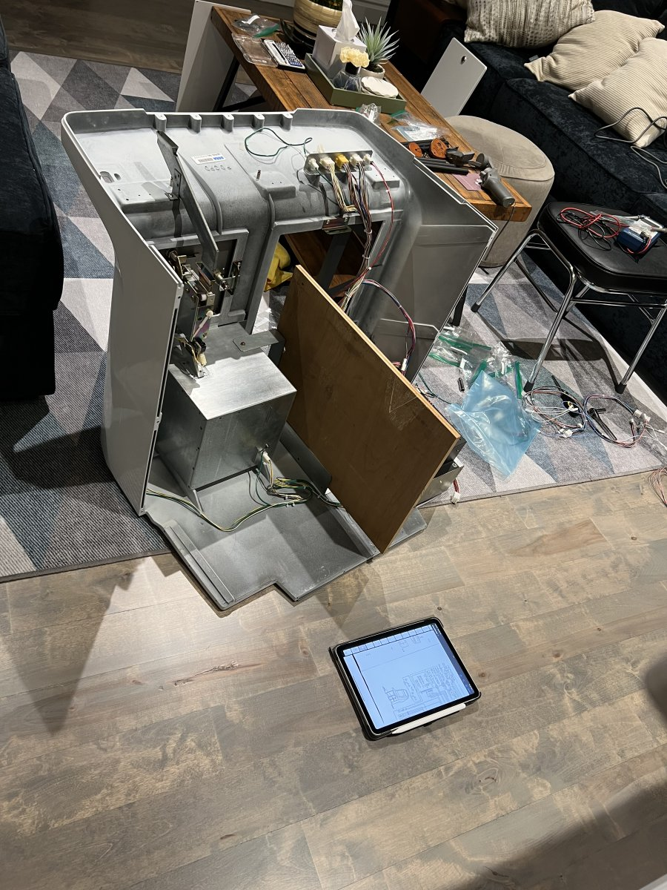
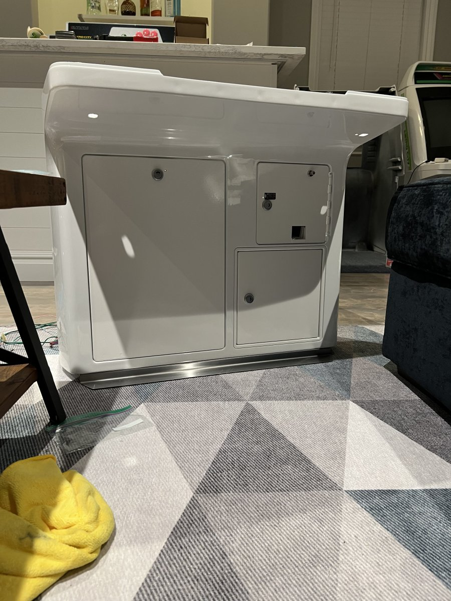
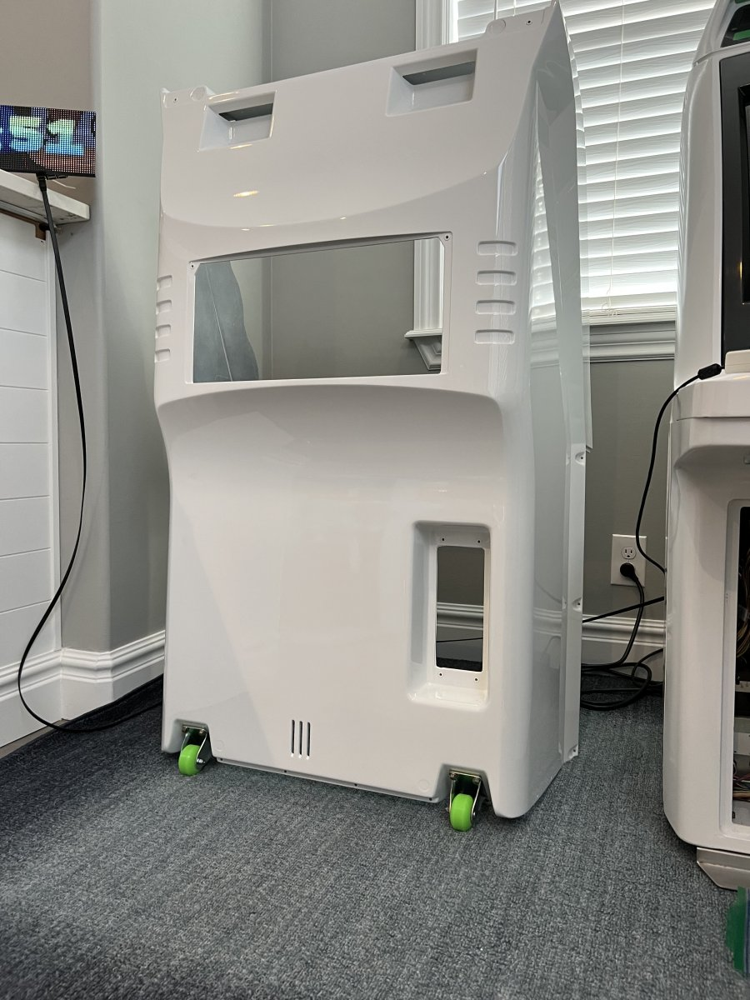
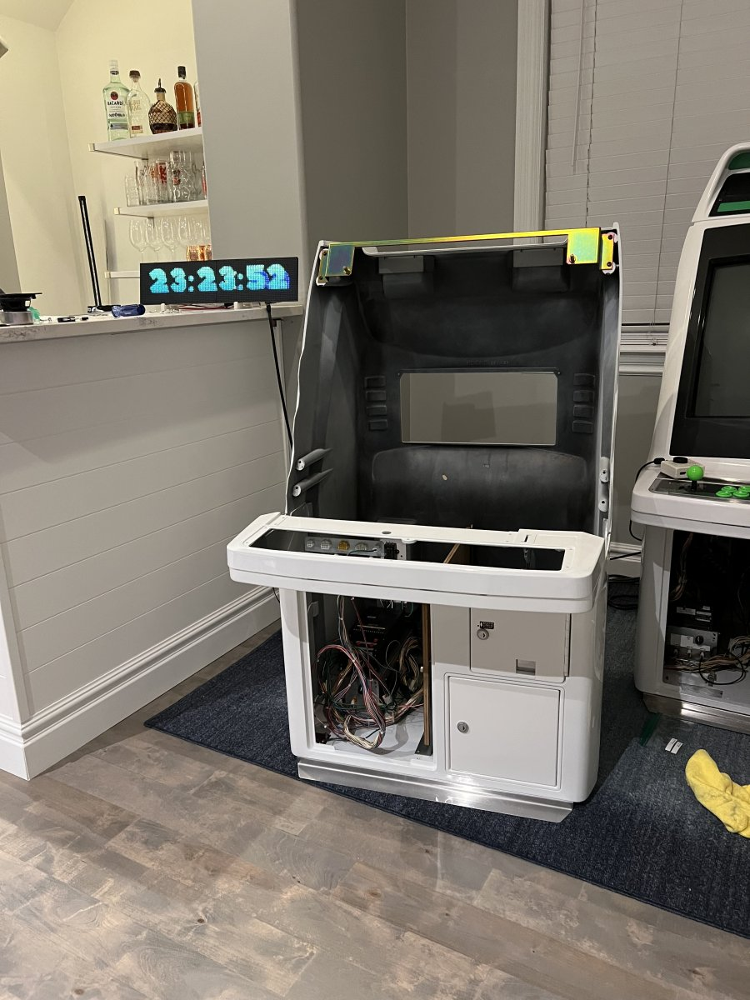

# Reassembly

Reassembly of these machines is quite straightforward. As I took things apart I labeled bags of screws etc to not lose parts; however, the [service manual](https://wiki.arcadeotaku.com/images/0/0a/AstroCityMan.pdf) is extremely helpful. The pictures are usually all you need, but Google Translate saves the day!

---

The three main pieces are assembled as units. Get everything into the Cash Box together, do the same for the rear (except the CRT. Save that for last) and then the front panel / face. 

If I do this again, I think I'll opt to paint the doors. Although the powdercoat came out great, the doors were not the easiest to shut. Clearly the powdercoat was just a bit too thick. Eventually I was able to get everything in the right place.

Main body complete with new wheels.

When putting the Cash Box and Main Body together, make sure to lift the Cash Box on top of the caster plates. Once together, it's about 20 screws or so. 

Something to note: all of the locks in the Astro City (5380) only allow you to remove the key once the lock is in the "locked" position. With some curiosity and time I found that this funcitonality can be removed. I documented this [in a video](https://youtu.be/6sQIpw7sBck). 

This can be very helpful since the control panel requires two keys to be opened. Many arcades decided to just bend the control panel upwards instead; but this can damage the plastic and cause cracking.

